# Applied Neural Engineering: Brain and Spine Neurosurgery and Human/Machine Interfaces


This repo contains my Applied Neural Engineering Semninar tasks at [Friedrich ALexander University, Erlangen](https://www.nsquared.tf.fau.de/).

## Objective

The primary objective of this tasks is to conduct a comparative analysis between brain signals, intracortical electrodes, and electromyography (EMG) signals.

Using MATLAB, I analyzed the data, gaining insights into the differences in characteristics, such as power spectrum, action potential waveform, and interspike interval variability, between these two types of signals.

## Brain Data


| Variable | Dimension        | Description                           |
|----------|------------------|---------------------------------------|
| SIG      | 23x3 cell array  | Intracortical electrode signal        |
| Spikes   | 1x11 cell array  | Neuron firing time (in samples)       |
| fsamp    | 25000 Hz         | Sampling rate of the signals          |

___
## EMG Data

| Variable  | Dimension         | Description                                |
|-----------|-------------------|--------------------------------------------|
| SIG       | 13x5 cell array   | EMG electrode signal                       |
| MUPulses  | 1x32 cell array   | Moto Unit firing time (in samples)         |
| fsamp     | 2048 Hz           | Sampling rate of the signals               |

___

For both signals (EMG and Brain), each cell array in varibale SIG represents an electrode channel. Consequently, we derive an averaged signal from each channel, facilitating a quick analysis of signal characteristics.


<div style="text-align: center;">

```math
EMG_{SIG}  = \sum_{i=1}^{13} \sum_{j=1}^{5} SIG(i,j)

```

```math
 Brain_{SIG}  = \sum_{i=1}^{23} \sum_{j=1}^{3} SIG(i,j)
```

</div>

<div style="display: flex;">
</br>

</div>

## Analysis Results

Below are some of the results of the analysis.

________
________
# Brain

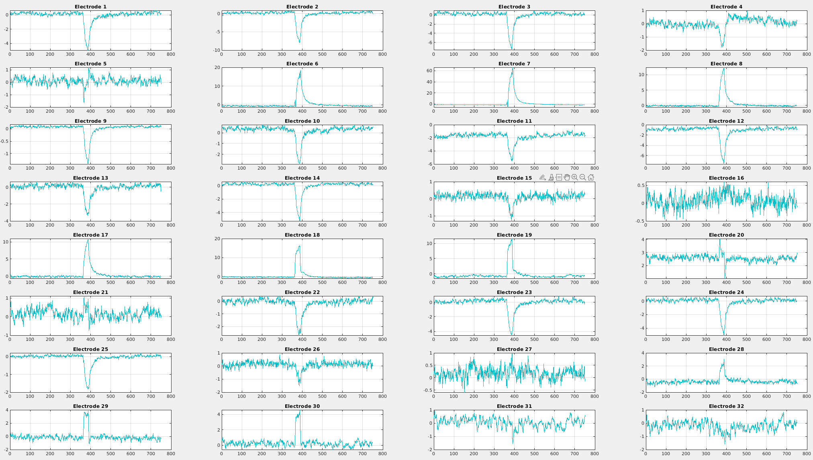

______

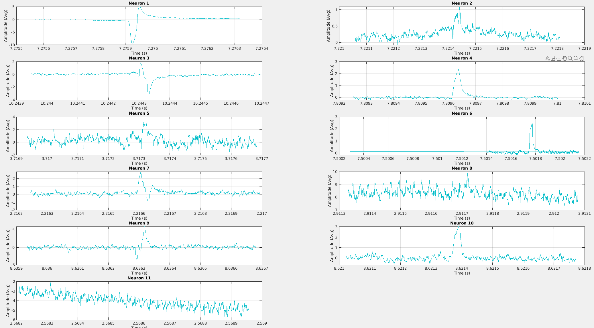

______

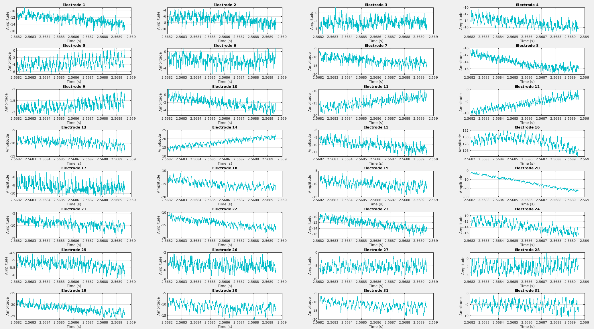

______

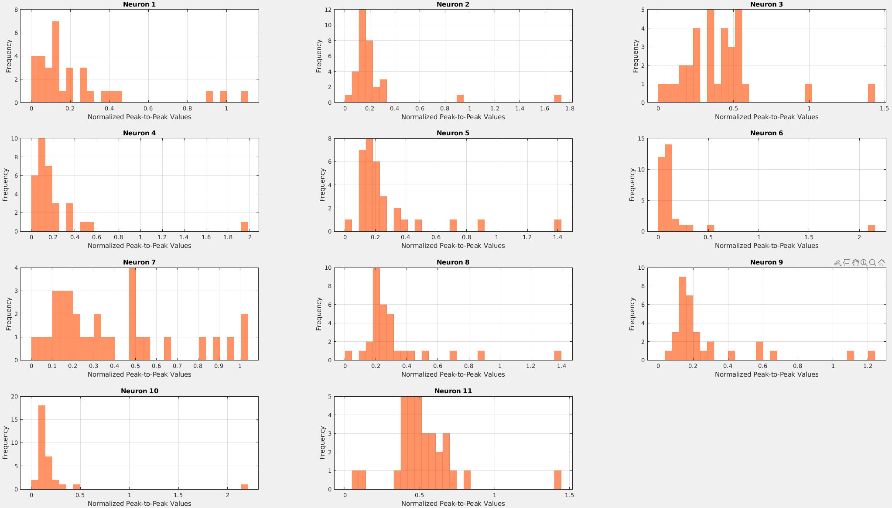


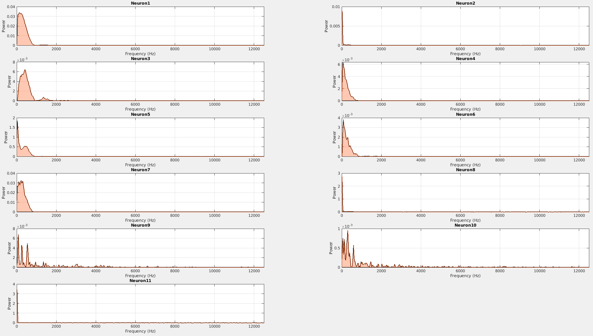


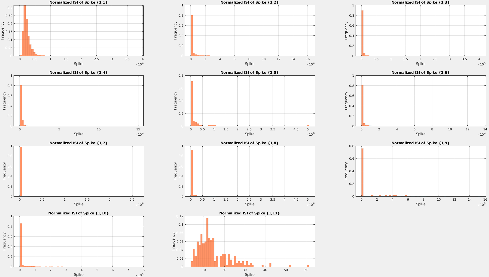


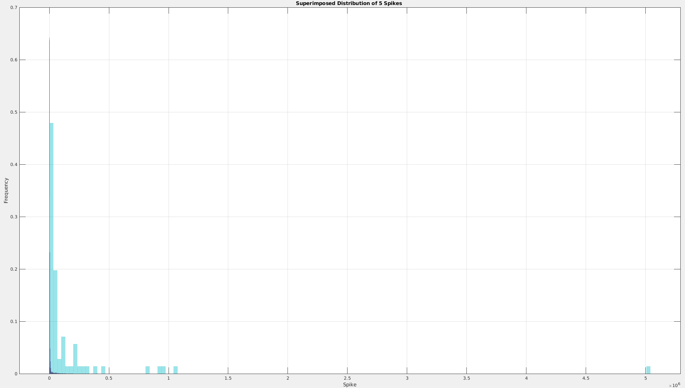
_______

_______


## EMG 

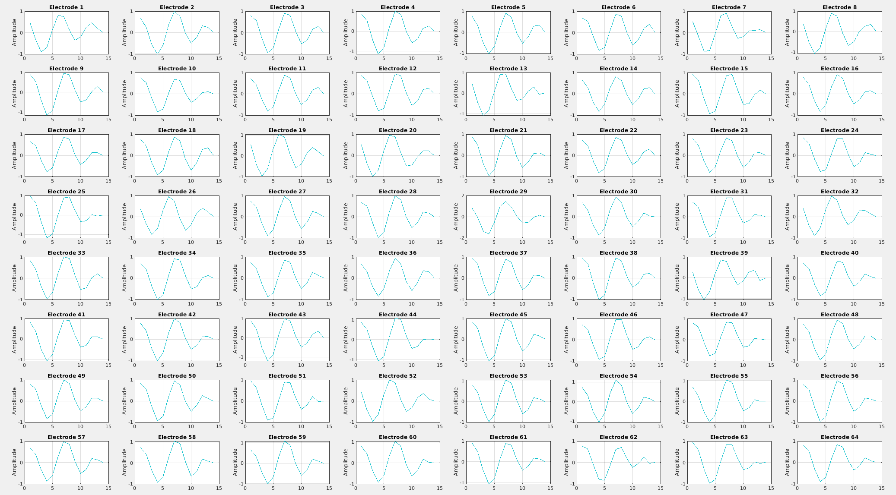

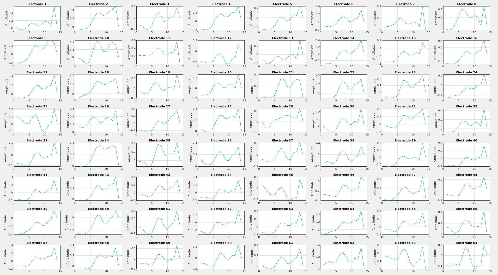


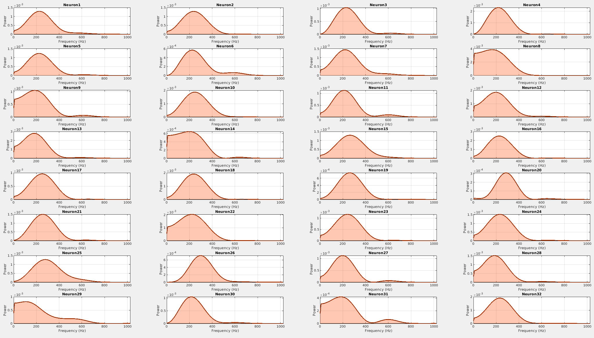


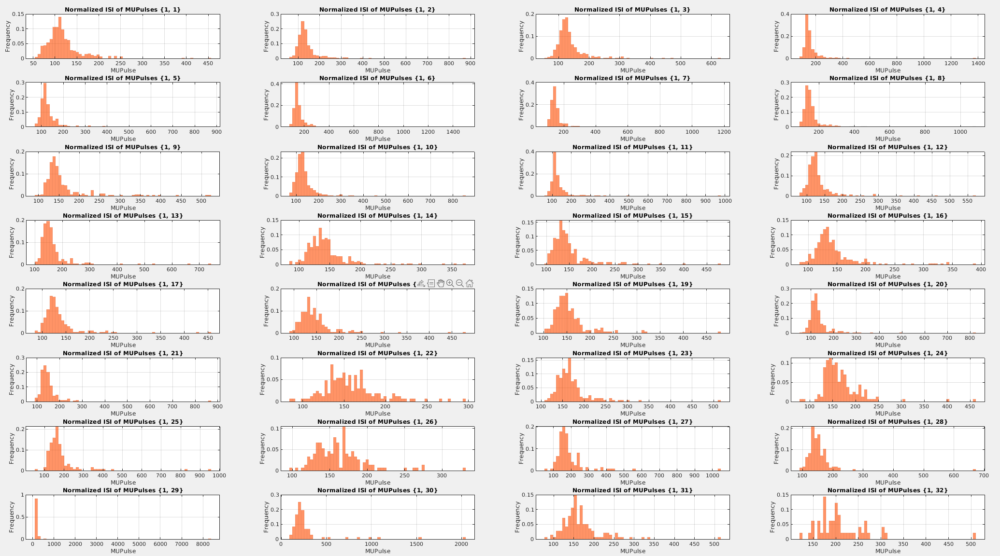

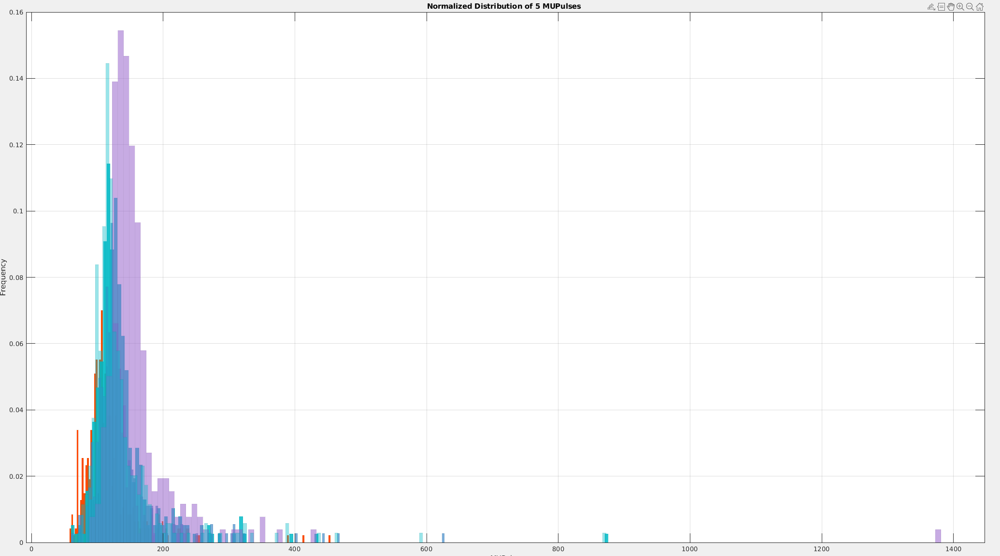


##


Full details of the analysis and a [detailed report](#) will be uploaded later.